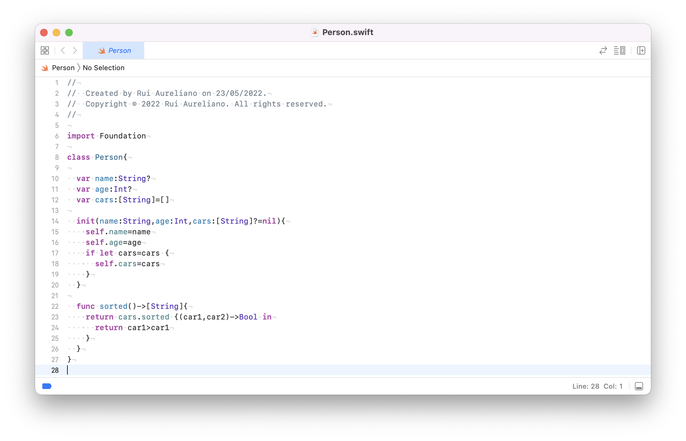
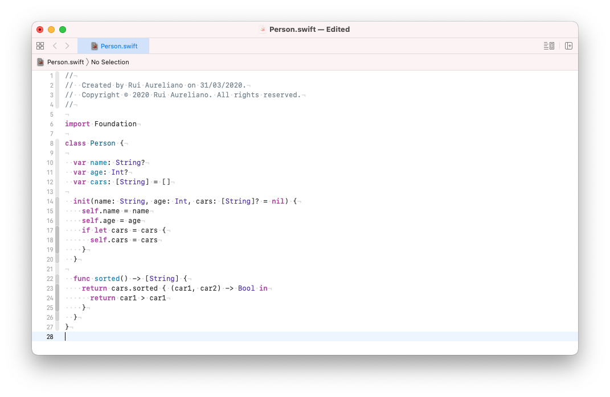
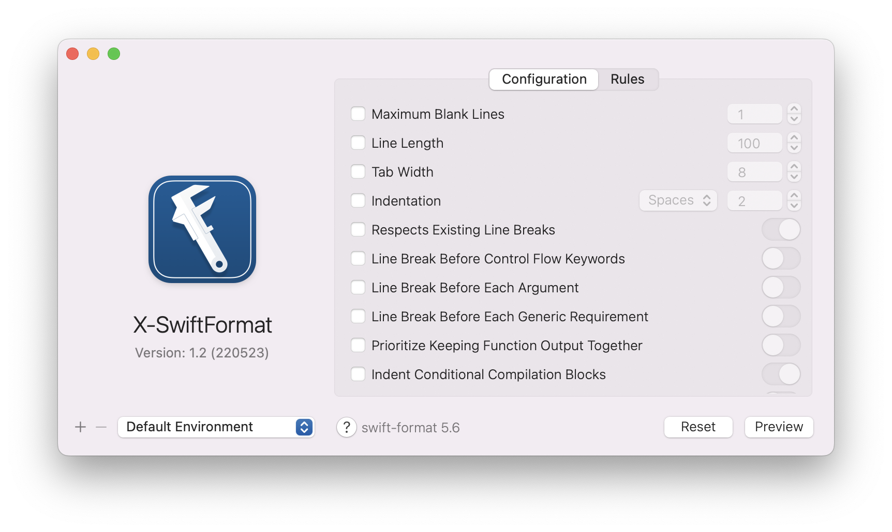
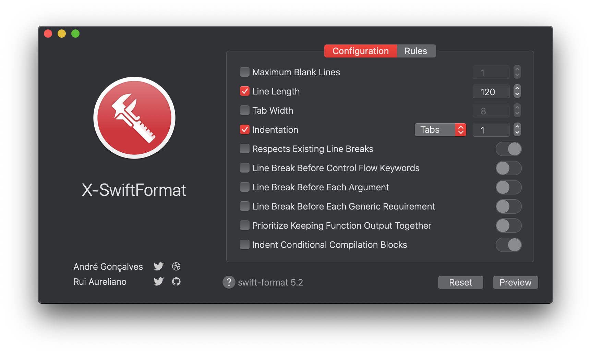
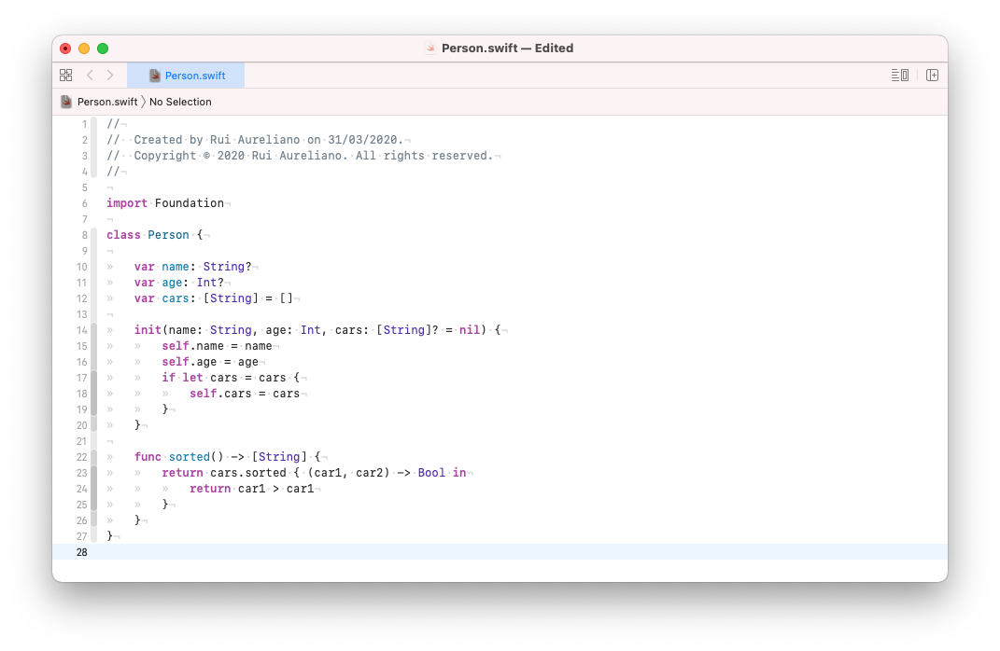
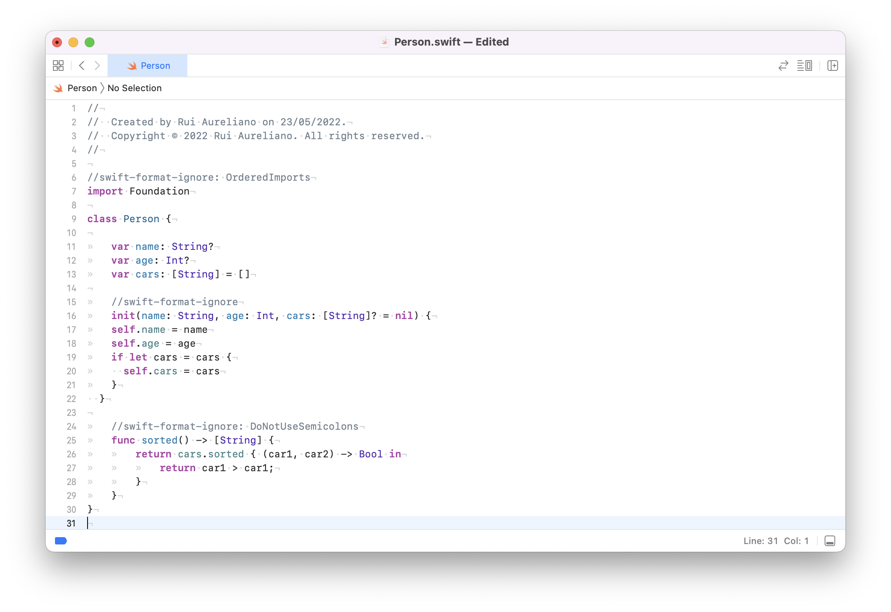
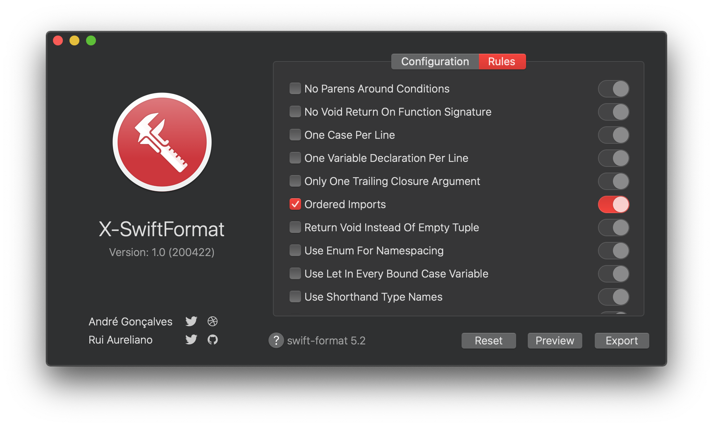
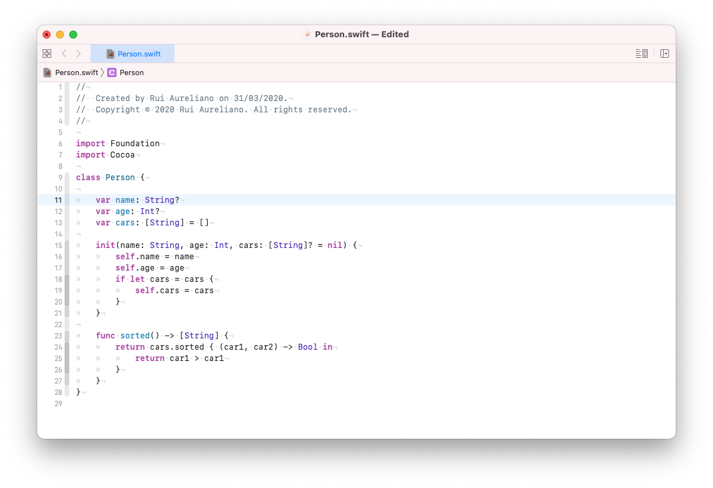
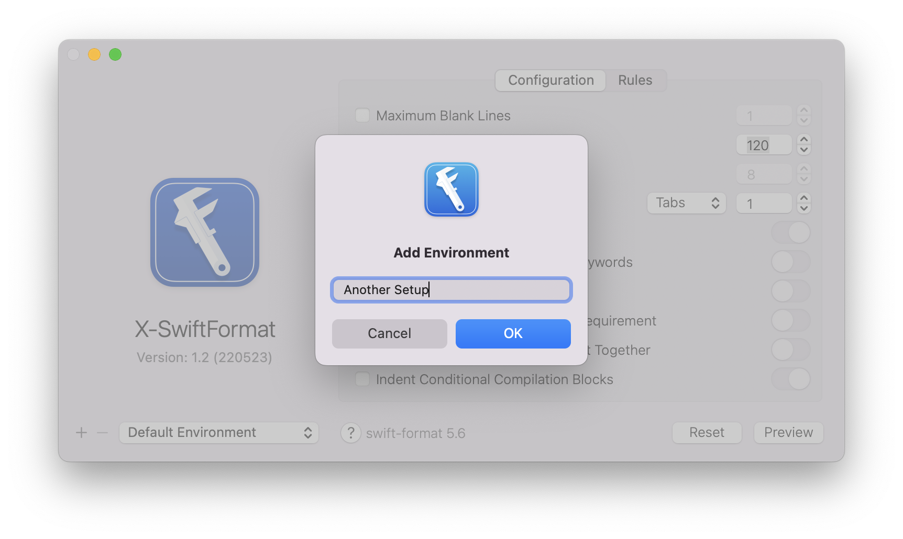
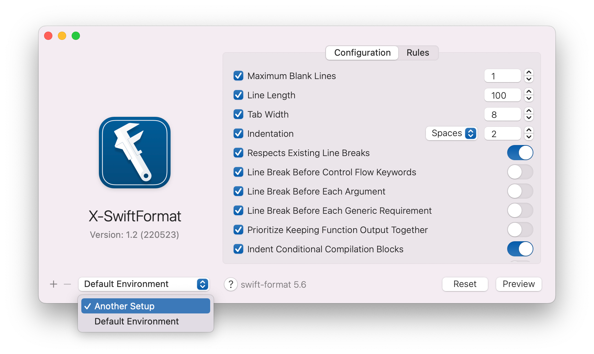

# 👨‍🏫 Docs

  

X-SwiftFormat is a Xcode Plugin built on top of two cool frameworks:

1. **Formatting technology for Swift source code** - https://github.com/apple/swift-format
1. **SwiftPM package for SwiftSyntax library** - https://github.com/apple/swift-syntax

---

#### ⚠️ Please make sure your setup is complete (see how [here](./README.md))

**1)** Open **Swift** file with **Xcode**

**2)** Once you are editing a **Swift** file in **Xcode**, you can format this file using the **X-SwiftFormat Extension**. Just go to **Editor** ▸ **X-SwiftFormat** ▸ **Format Swift Code**. Done, code is formatted with default settings.

**3)** You can open **X-SwiftFormat** app to change some settings. Read more [here](https://github.com/apple/swift-format/blob/master/Documentation/Configuration.md)

**4)** I will just change two options here, `Line Length = 120` and use `Tabs = 1`. We have more options to change.

**5)** Formatting the code again will use my custom settings, i.e will use tabs and 120 is the maximum allowed length of a line, in characters.

**6)** Another cool feature is the ability to suppress formatting within a section of source code. Read more [here](https://github.com/apple/swift-format/blob/master/Documentation/IgnoringSource.md)

1. `// swift-format-ignore`
1. `// swift-format-ignore: OrderedImports`
1. `// swift-format-ignore: DoNotUseSemicolons`

Using those rules, imports will not be sorted, the block `[17-23]` will not be formatted and we can use semicolons on the block `[26-30]`.

**7)** **X-SwiftFormat** app also allows setting rules to suppress formatting. **Ordered Imports** is now disabled.

**8)** This means even with no comments, imports will not be sorted.

**9)** After version 1.1, its possible to have multiple environments, this will help if you work with multiple porjects and **multiple configurations**. Press the `(+)` and add the name you want.

**10)** You can switch between configuration using the dropdown.

---

I'm [Rui Aureliano](http://ruiaureliano.com), iOS and macOS Engineer at [Olá Brothers](https://theolabrothers.com). We make [Sip](https://sipapp.io) 🤓

[Linkedin](https://www.linkedin.com/in/ruiaureliano) | [AngelList](https://angel.co/ruiaureliano) | [Twitter](https://twitter.com/ruiaureliano) | [Github](https://github.com/ruiaureliano) | [Medium](https://medium.com/@ruiaureliano) | [Stackoverflow](https://stackoverflow.com/users/881095/ruiaureliano)
