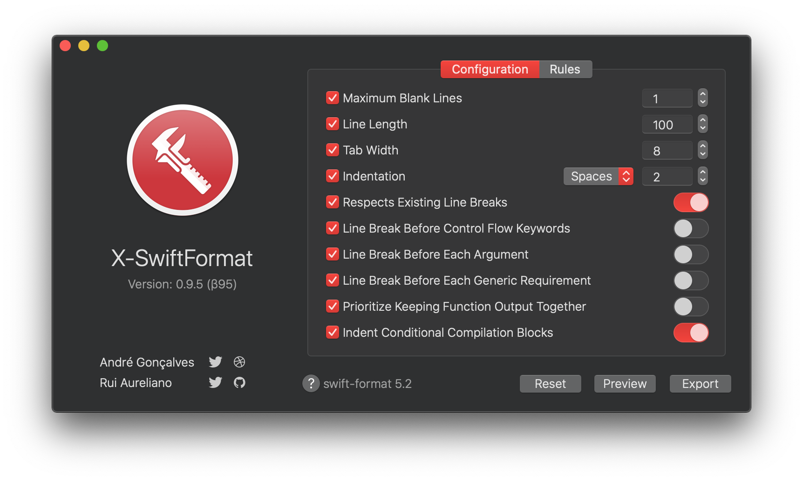
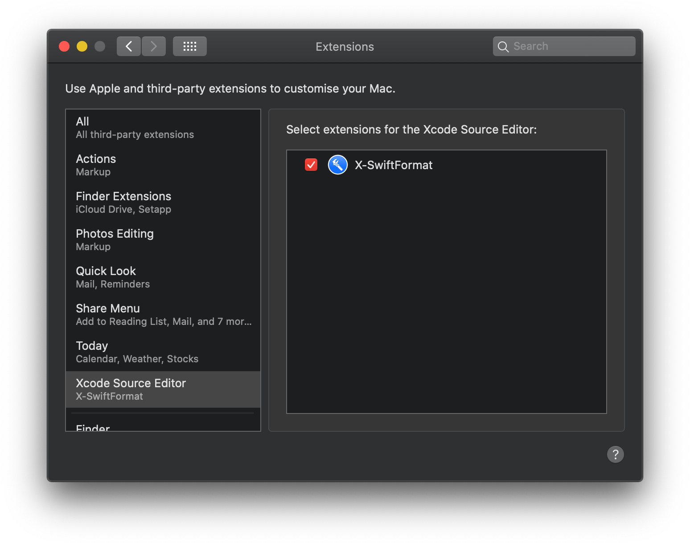
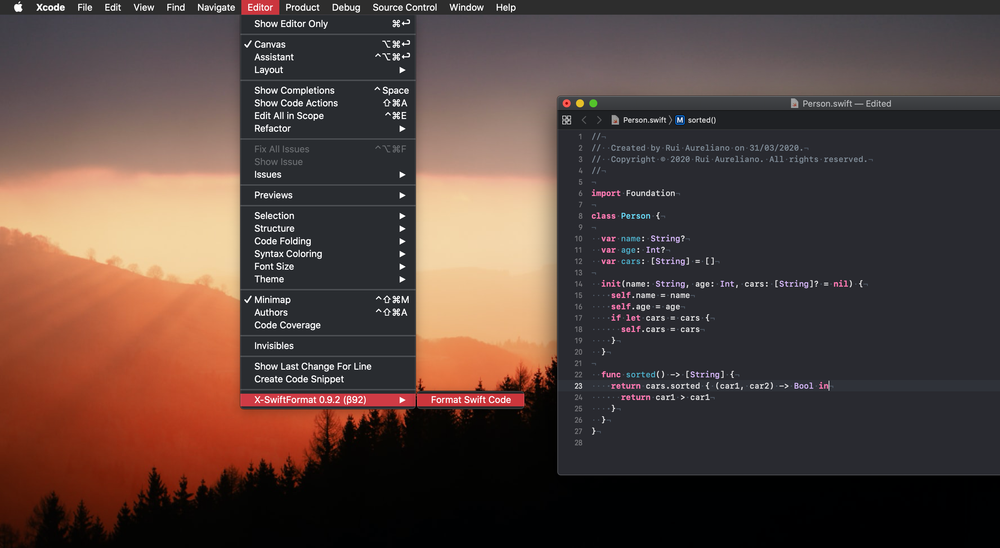
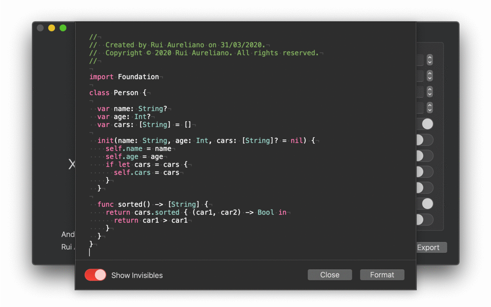
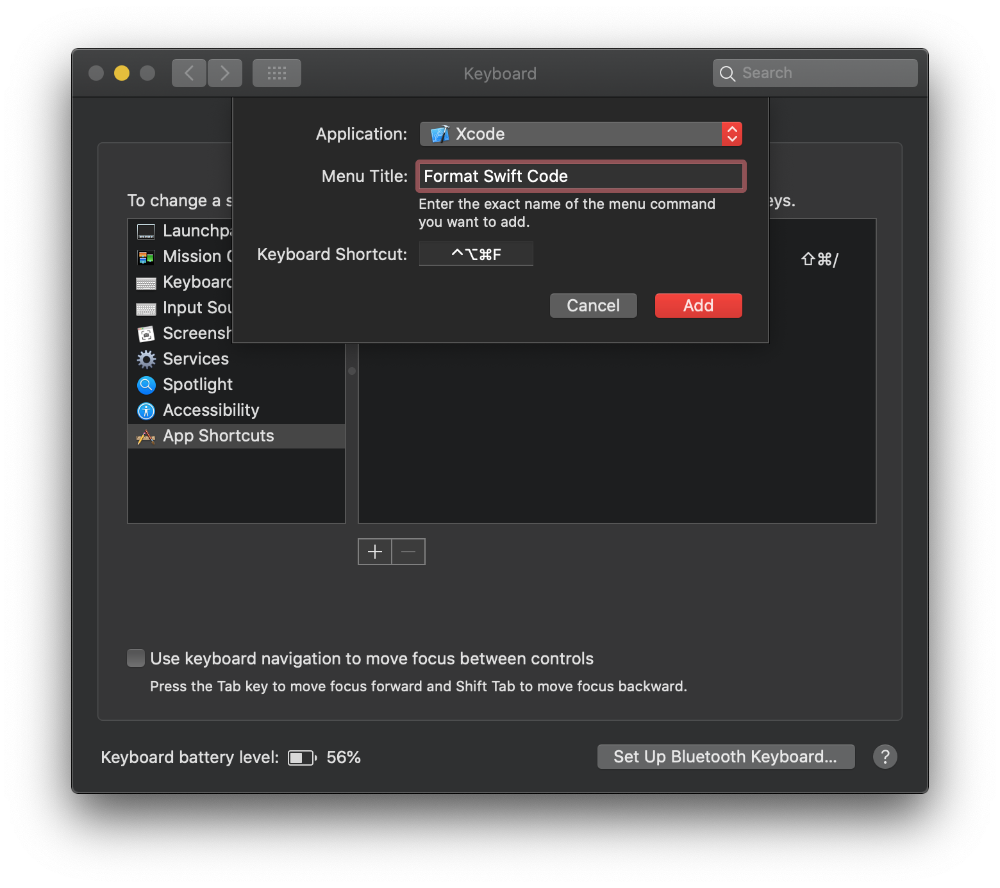

# 🛠 X-SwiftFormat 

### 🔗 Download [X-SwiftFormat 0.9.1 βeta](https://github.com/ruiaureliano/X-SwiftFormat/releases/latest)

---

### 1) Open X-SwiftFormat

**X-SwiftFormat** works as Xcode Extension to format your swift code. You will need to open this once to activate it 👍

### 2) Enable X-SwiftFormat

Open **System Preferences** ▸ **Extensions** ▸ **Xcode Source Editor** and make sure **X-SwiftFormat** is selected ✅

### 3) Use X-SwiftFormat

Open Xcode and use the **Format Source Code** command in Xcode's **Editor** menu 🚀

You case use the **Preview**

### 4) Add X-SwiftFormat Shortcut

Ppen **System Preferences**, click on **Keyboard**, and switch to the **Shortcuts** tab. Select **App Shortcuts**, then hit the <kbd>+</kbd> button. Select **Xcode**, enter `Format Swift Code` and set your **Shortcut**.👏

